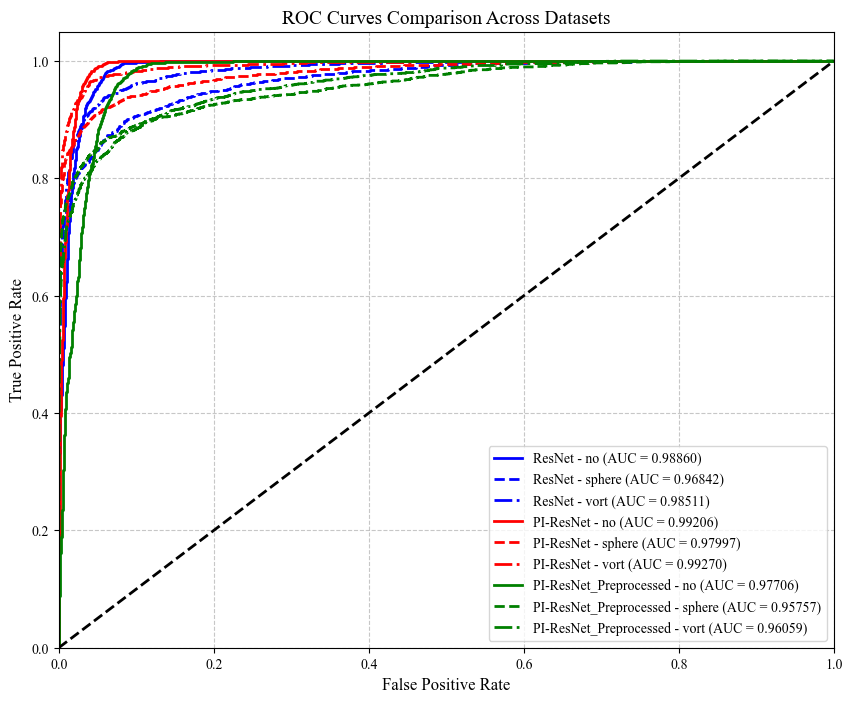

# DeepLense

    \
  

This repository contains implementations of **ResNet-18**, Physics-Informed ResNet-18 (**PI-ResNet-18**) and PI-ResNet-18 with gradient preprocessing (**ResNet-18-Preprocessed**) models for classifying dark matter substructures, developed as part of the Machine Learning for Science (ML4Sci) Google Summer of Code (GSoC) 2025 DeepLense evaluation tasks.

- [Resume](doc/resume_bruce_hu.pdf)  
- [Technical Report](doc/report.pdf)  

## Table of Contents
- [Method](#method)
- [Results](#results)
- [Notebooks](#notebooks)
- [Model Weights](#model-weights)

## Method

### Task 1: Standard ResNet-18
- **Model:** ResNet-18  
- **Description:** A standard ResNet-18 model is implemented to classify dark matter substructures in gravitational lensing images. 

### Task 2: Physics-Informed ResNet-18
- **Model:** PI-ResNet-18  
- **Description:** A Physics-Informed ResNet-18 (PI-ResNet-18) integrates gravitational lensing equations into the classification pipeline, utilizing the **Physics Block** from [LensPINN](https://github.com/ML4SCI/DeepLense/blob/main/DeepLense_Physics_Informed_Neural_Network_for_Dark_Matter_Morphology_Ashutosh_Ojha/Notebooks/lenspinn.ipynb) that computes the inverse source image using gravitational lensing equations. The inverse source image is combined with the observed lensing image as a two-channel input to ResNet-18.    

- **Model:** PI-ResNet-18-Preprocessed
- **Description:** A gradient map is generated based on lensing images as the third channel of PI-ResNet-18.

## Results
The models were evaluated using ROC curves and validation loss metrics across datasets labeled 'no', 'sphere', and 'vort'. Below are the visualizations:

  
*Figure 1: ROC curves showing the classification performance of ResNet-18, PI-ResNet-18, and PI-ResNet-18 with Gradient Preprocessing across the three datasets - no substructure, subhalo substructure, and vortex substructure.*

  
*Figure 2: Validation loss over training epochs for the three models, illustrating their convergence behavior.*

For details, see the [Technical Report](doc/report.pdf).

## Notebooks
- **`task_1_ResNet.ipynb`**: Implements and trains the standard ResNet-18 model for Task 1.  
- **`task_5_PI_ResNet.ipynb`**: Implements and trains the PI-ResNet-18 model for Task 5.  
- **`task_5_PI_ResNet_preprocess.ipynb`**: Implements and trains the PI-ResNet-18-Preprocessed model for Task 5.  
- **`evaluate.ipynb`**: Evaluates model performance and generates ROC curves for comparison.

## Model Weights
Pre-trained model weights are available for download from Google Drive:  
[Download Model Weights](https://drive.google.com/file/d/1D8sW_VU_S3X1Rk6sWX3rBKcFelpYo-uP/view?usp=sharing)  

- **`ResNet 91.pth`**: Weights for the standard ResNet-18 model (Task 1).  
- **`PI_ResNet 95.pth`**: Weights for the PI-ResNet-18 model (Task 5).  
- **`PI_ResNet_Preprocessed 90.pth`**: Weights for the PI-ResNet-18 model with gradient preprocessing (Task 5).
